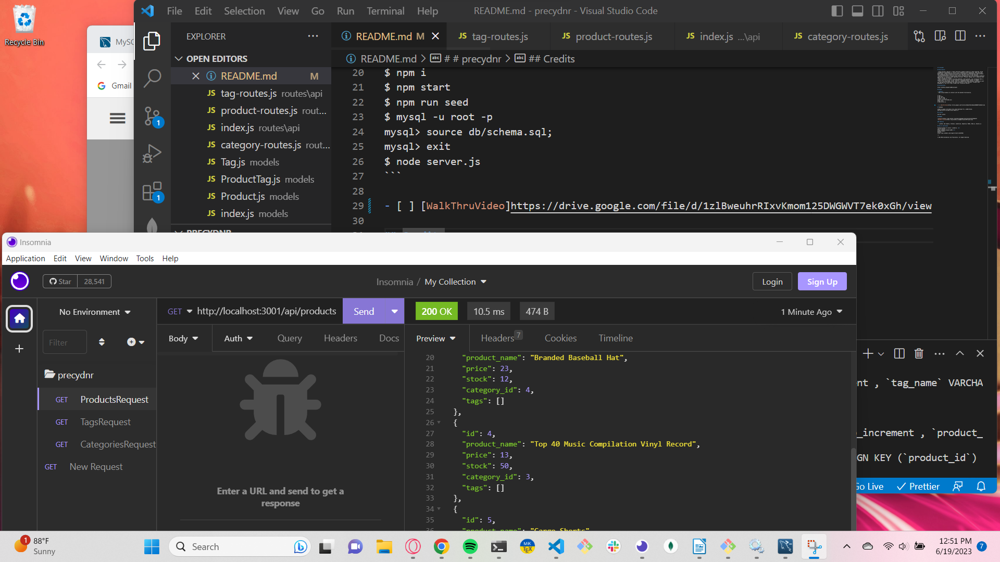

# # precydnr

## Description:

- Doing buisness requires a robust back-end e-commerce website to keep organized. Using contemporary technologies is crucial to be competitive and cooperative, even with cash based sales, product tracking and inventory is paramount to profitability. Meet precydnr, your bookeeping engine built to track in real time the status of your business.
- Having the ability to customize your data to integrate or port from existing e-commerace applications is necessary when upgrading software. Precyndr manages your e-commerace data exactly how you do business.
- Most e-commerace is done on existing templates. With precyndr, your finiancial data is modeled upon the function of your business, providing details exactly as needed.
- Tech is not going away, infact, even in a commodities based economy, tracking will give you the ability to determine the future direction of your business. Precydnr data management is the first step to model your finiancial destiny.

## Installation

https://github.com/gdutra2002/precydnr

## Usage

> **Note**:
> Demo using Insomnia to interact with the backend functionality.

```
$ npm i
$ npm start
$ npm run seed
$ mysql -u root -p
mysql> source db/schema.sql;
mysql> exit
$ node server.js
```

- [ ] [WalkThruVideo]https://drive.google.com/file/d/1zlBweuhrRIxvKmom125DWGWVT7ek0xGh/view



## Credits

Credit is given to UC Davis full stack bootcamp TA's, askBCS David, UCD-VIRT-FSF-PT-12-2022-U-LOLC Module 13

## License

See MIT license

## Badges


### Features

> - github, npm inquery, terminal, JavaScript, Sequelize, MySQL, Node.js, Express.js

## How to Contribute

Prefered method of contact: Linked-In. <br>
Link to source:
https://github.com/gdutra2002 <br>
Contact author:
Profile
https://www.linkedin.com/in/gary-e-dutra-15357940/

---

© 2023 MRB Confidential and Proprietary. All Rights Reserved.
